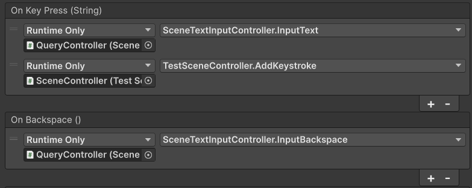

# VR Open Text Input
This project is a Unity Package Manager package containing three text input methods for generic VR controllers implemented using [OpenXR](https://www.khronos.org/openxr/). This project was created as part of a Bachelor Thesis involving [vitrivr](https://vitrivr.org/), where input methods in VR were implemented and evaluated. It has since not been mantained, but kept accessible for archival purposes. The package is fully functional as of November 2024 (tested on Unity 6).

Read the thesis [here](docs/thesis.pdf).

The implented input methods are:

| Name   |      Preview      |  Description |
|----------|:-------------:|------|
| Virtual Keyboard |   | A replica of the real-world tried-and tested-keyboard |
| Drumstick Keyboard |       |   Similar to a real keyboard, but triggered using drumsticks to reduce arm fatigue |
| Analog Stick Keyboard |  |  A new approach to text-input using analog sticks and triggers with a steep but rewarding learning curve|

# Installation

## Option A: Import from git URL 

In the Unity editor, go to Window -> Package Manager -> + -> "Install package from git URL..."

Enter ```https://github.com/N4karin/vr-open-text-input.git``` and  click on install

## Option B: Manual Import
Clone or download the repository and import the keyboards as a set using the Unity Package Manager:

In the Unity editor, go to "Window" -> "Package Manager" -> "+" -> "Import Package..." and select ```package.json``` in directory of the cloned/downloaded repository.

The functionality of the keyboards can be tested beforehand in a provided scene called "KeyboardTestEnvironment" in Assets/Scenes.

# Set up
- Insert desired keyboard from Assets/Prefabs to scene
- For *Virtual Keyboard* and *Drumstick Keyboard*
	- Attach a collider ('Is Trigger' deactivated) to any game object and tag the game object as "KeyboardTrigger" (For Example a game object representing hands or fingers or for the Drumstick Keyboard, the supplied drumstick assets)
	- The corresponding object is now interactable with the keyboard prefabs	
- For *Analog Stick* Keyboard
	- Import both left and right parts of the assets into the scene
	- Attach the left part to the left controller and the right part to the right controller
	- Adjust desired angle and visibility of the disks and stick position indicator
- In the inspector, under the component "KeyController (Script)" assign the registered keystrokes to a target game object (like a text field object or scene controller)
Example:


# Licensing
VR Open Text Input is released under the MIT License, which will also apply to any contributions and forks. See the file LICENSE.


Happy typing!